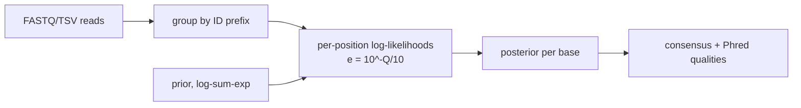

# phred-consensus

[](https://github.com/bmouler/phred-consensus/actions/workflows/ci.yml)


[](LICENSE)

A dependency-free Python library and CLI for Phred-aware Bayesian consensus calling from aligned, same-length reads. It combines observations in log space, reports posterior-derived consensus qualities, and offers an explicit unweighted majority baseline.

## Install

Python 3.11 or newer is required.

```bash
python -m pip install phred-consensus
```

For development and verification:

```bash
python -m pip install -e '.[dev]'
ruff check .
pytest --cov=phred_consensus --cov-branch --cov-fail-under=100
```

## Quickstart

FASTQ records are grouped by the portion of each record ID before `--delimiter` (default `/`). Groups must be contiguous and all reads within a group must be aligned and the same length.

```bash
phred-consensus reads.fastq --output-format jsonl
phred-consensus reads.fastq --delimiter ':' --min-posterior 0.99 -o consensus.fastq
```

The TSV format is headerless: `group`, `sequence`, and Phred+33 quality string.

```text
family1	ACGT	IIII
family1	ACGA	III$
```

```bash
phred-consensus reads.tsv --input-format tsv --output-format fastq
```

Use a nonuniform prior with all four positive weights:

```bash
phred-consensus reads.tsv --input-format tsv --prior A=2,C=1,G=1,T=2
```

Library use:

```python
from phred_consensus import call_consensus

result = call_consensus(
    ["ACGT", "ACGA"],
    [[40, 40, 40, 40], [40, 40, 40, 3]],
    min_posterior=0.95,
)
print(result.sequence, result.qualities, result.posteriors)
```

## Algorithm



For an observed base $b$ with Phred score $Q$, the error probability is $e=10^{-Q/10}$. The likelihood is $1-e$ when a candidate equals $b$, and $e/3$ for each of the other three bases. For candidate $x$ at a position, the implementation computes

$$
\log P(x \mid \text{reads}) = C + \log P(x) + \sum_i \log P(b_i \mid x,Q_i)
$$

and normalizes the four candidate scores with a log-sum-exp calculation. Ties resolve deterministically in `A,C,G,T` order. The winning posterior $p$ becomes consensus quality $\min(60,\operatorname{round}(-10\log_{10}(1-p)))$. If $p$ is below `--min-posterior`, the emitted base is `N`, while the posterior-derived quality is retained.

## Reproducible capability evidence

The repository includes a deterministic synthetic benchmark with 2,000 truth bases and five reads per base: three low-quality Q3 reads and two high-quality Q30 reads. Errors are sampled according to the same Phred model, with incorrect bases chosen uniformly. On seed 2026, the Bayesian caller has **1 mismatch (0.05%)**, while unweighted majority vote has **128 mismatches (6.4%)**.

Reproduce the exact result:

```bash
phred-consensus --benchmark --seed 2026 --bases 2000
```

The benchmark test asserts determinism and that the Bayesian mismatch count is lower; it does not treat this synthetic scenario as a claim about every biological dataset.

### End-to-end performance

`PYTHONPATH=src python benchmarks/benchmark_consensus.py --samples 11 --warmups 2` calls the
public consensus API across 240 heterogeneous aligned-read groups: 2,928 reads and 527,040
observations, with every `ConsensusResult` materialized. Fixture generation and interpreter
startup are outside the timed region.

On an Apple M3 Max with CPython 3.11.12 on 2026-08-15, frozen baseline `4bc06076cc50`
measured **353.470 ms** median and this implementation **121.415 ms**, a **2.911x speedup**.
Both runs produced SHA-256
`21481dbcff097c4aaf679005f7433940f31343e1d48eac299ac7de7b8a20a841`. These are
local in-process timings; rerun with `PYTHONPATH` pointed at the desired source worktree.

## Input validation

The caller rejects empty groups, unequal sequence/quality lengths, unequal aligned-read lengths, symbols outside `A/C/G/T`, quality values outside 0–93, malformed FASTQ structure, non-Phred+33 text, blank or malformed TSV rows, invalid priors, invalid posterior thresholds, and noncontiguous repeated groups. Errors are reported on stderr with a nonzero status.

## Verification

### Mutation testing

The deterministic suite generated **764 mutants and killed 729 (95.42%)**. The 35 survivors were individually reviewed and are behavior-equivalent under the validated public contract, not missed mutants; there were zero suspicious results and zero timeouts. Mutation testing also exposed duplicate prior keys being silently overwritten; the parser now rejects them.

| Reviewed equivalent rationale | Count |
| --- | ---: |
| Validated equal-length inputs make strict/non-strict `zip` behavior identical | 15 |
| Parser delimiter, `maxsplit`, separator, and sentinel identities | 12 |
| Additive log-prior normalization constants cancel from posterior ratios | 3 |
| The posterior-quality floor is hidden by integer rounding and the quality-60 cap | 1 |
| The infinity guard differs only for unreachable validated states | 1 |
| UTF-8/type-only/default identities and benchmark PRNG equality | 3 |
| **Total reviewed equivalents** | **35** |

Reproduce the campaign from the repository root:

```bash
source .venv/bin/activate
mutmut run
mutmut results
```

## Limitations

- Reads must already be aligned, ungapped, and equal length within a group.
- Only canonical `A/C/G/T` observations are accepted; ambiguity symbols and gaps are deliberately rejected.
- FASTQ qualities use Sanger Phred+33 and are limited to the representable range 0–93.
- Under the stated substitution model, Q0 means `P(correct)=0`: the observed symbol is anti-evidence rather than an uninformative observation. Datasets that use Q0 as a missing-quality sentinel must filter or recode those observations before calling consensus.
- The model assumes conditionally independent read errors and uniform substitution among the three incorrect bases; it does not model indels, strand bias, context effects, correlated PCR errors, or platform-specific confusion matrices.
- Input is processed without network access. Completed groups are yielded incrementally; memory is bounded by the largest group plus the set of prior group names used to reject noncontiguous repeats.
- The 60 cap prevents misleadingly extreme output qualities and means very strong posterior distinctions are intentionally compressed.
